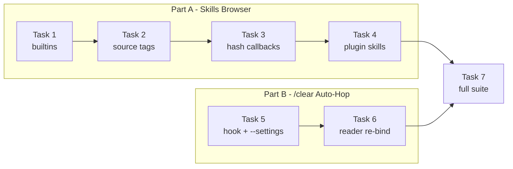
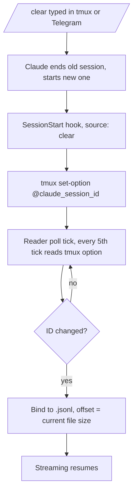

# Skills Browser Rework + `/clear` Auto-Hop Implementation Plan

> **For agentic workers:** REQUIRED SUB-SKILL: Use superpowers:subagent-driven-development (recommended) or superpowers:executing-plans to implement this plan task-by-task. Steps use checkbox (`- [ ]`) syntax for tracking.

**Goal:** Rework the bridge `/skills` browser (source tags, plugin skills, model/effort pickers, short-hash callbacks) and make the transcript reader follow `/clear`/`/resume`/`/branch` hops automatically.

**Architecture:** Part A reworks `src/skills/` discovery and menus: built-in commands shrink to 4 entries with choice pickers, every skill carries a `source` label, plugin skills are scanned from `installed_plugins.json`, and all `callback_data` payloads switch to deterministic short SHA-1 hashes (Telegram caps `callback_data` at 64 bytes). Part B adds a SessionStart hook that publishes the live Claude session id onto the tmux session; the transcript reader re-checks that id every 5th poll tick and re-binds to the new `.jsonl` without replay.

**Tech Stack:** Node.js ES Modules, Telegraf, native `child_process` tmux CLI, `node:test` runner. No new npm dependencies (crypto/fs/path are stdlib).

**Spec:** `docs/superpowers/specs/2026-09-12-1820-skills-browser-clear-hop-design.md` (in the `claude-code-telegram-coolify` repo)



## Global Constraints

- All paths below are relative to `claude-code-telegram-coolify/claude-telegram-bridge/`. Run all commands from that directory.
- Run one test file: `node --test test/<name>.test.js`. Run everything: `npm test` (Node native test runner).
- No new npm dependencies. Use Node stdlib (`node:crypto`, `node:fs`, `node:fs/promises`, `node:path`, `node:url`).
- Every generated `callback_data` string must stay ≤ 64 bytes (Telegram hard limit; verified in the telegram-bot-api skill reference).
- Model choices exactly `['fable', 'opus', 'sonnet', 'haiku']`; effort choices exactly `['low', 'medium', 'high', 'xhigh', 'max']`.
- Builtin descriptions copied verbatim from the spec (Task 1 code block is authoritative).
- Hook script timeout: 5 (seconds) in the generated settings file.
- Commits happen in the `claude-code-telegram-coolify` git repo (one level above the bridge directory).
- Do not touch the typed-command passthrough (`commandMapping` in `src/index.js:556-572`) and do not change global Claude settings.

---

## File Structure

| File | Responsibility | Change |
|------|----------------|--------|
| `src/skills/scanner.js` | Built-in list, labeled dirs, plugin discovery | Tasks 1, 2, 4 |
| `src/skills/menu.js` | Icons, hashing, keyboards, inspect views | Tasks 2, 3 |
| `src/index.js` | Merge plugin skills, `skillByHash`, choice handler, reader re-bind hook-up | Tasks 3, 4, 6 |
| `src/diagnostics.js` | Source labels + plugin section in `/diag` | Tasks 2, 4 |
| `src/projects/manager.js` | Generate hook settings file, `--settings` launch flag | Task 5 |
| `src/tmux/session_reader.js` | Periodic re-bind to the live session id | Task 6 |
| `hooks/claude-session-id-sync.sh` | SessionStart hook (new file) | Task 5 |
| `.gitignore` | Ignore the generated settings file | Task 5 |
| `test/*.test.js` | Per §6 of the spec | every task |

---

### Task 1: Built-in commands — keep `clear`/`compact`, add `model`/`effort` pickers

**Files:**
- Modify: `src/skills/scanner.js:6-15` (`getBuiltInCommands`)
- Test: `test/skills_scanner.test.js:9-17` (replace the builtin test)

**Interfaces:**
- Consumes: nothing new.
- Produces: `getBuiltInCommands()` → `[{ id, name, description, command, choices? }]`. Task 3 relies on `choices` existing on `builtin:model` and `builtin:effort`.

- [ ] **Step 1: Write the failing test**

Replace the test `getBuiltInCommands returns core Claude commands` (lines 9-17 of `test/skills_scanner.test.js`) with:

```javascript
test('getBuiltInCommands keeps clear+compact and adds model/effort pickers', () => {
  const builtins = getBuiltInCommands();
  assert.deepEqual(builtins.map(c => c.name), ['clear', 'compact', 'model', 'effort']);

  const model = builtins.find(c => c.name === 'model');
  assert.equal(model.command, '/model');
  assert.equal(model.description, 'Switch model (fable, opus, sonnet, haiku)');
  assert.deepEqual(model.choices, ['fable', 'opus', 'sonnet', 'haiku']);

  const effort = builtins.find(c => c.name === 'effort');
  assert.equal(effort.command, '/effort');
  assert.equal(effort.description, 'Adjust thinking effort');
  assert.deepEqual(effort.choices, ['low', 'medium', 'high', 'xhigh', 'max']);
});
```

- [ ] **Step 2: Run test to verify it fails**

Run: `node --test test/skills_scanner.test.js`
Expected: FAIL — builtins still contain `cost`/`doctor`/`review`/`help` and no `choices`.

- [ ] **Step 3: Replace `getBuiltInCommands` body**

In `src/skills/scanner.js:6-15`, replace the returned array with:

```javascript
export function getBuiltInCommands() {
  return [
    { id: 'builtin:clear', name: 'clear', description: 'Clear conversation context and restart clean', command: '/clear' },
    { id: 'builtin:compact', name: 'compact', description: 'Summarize and compress current chat history', command: '/compact' },
    { id: 'builtin:model', name: 'model', description: 'Switch model (fable, opus, sonnet, haiku)', command: '/model', choices: ['fable', 'opus', 'sonnet', 'haiku'] },
    { id: 'builtin:effort', name: 'effort', description: 'Adjust thinking effort', command: '/effort', choices: ['low', 'medium', 'high', 'xhigh', 'max'] }
  ];
}
```

No other change in this task. The typed passthrough already works: `/model opus` matches `commandMapping` and injects `/model opus` (`src/index.js:556-572`).

- [ ] **Step 4: Run test to verify it passes**

Run: `node --test test/skills_scanner.test.js`
Expected: PASS (all tests in the file).

- [ ] **Step 5: Check the rest of the suite for builtin-count fallout**

Run: `node --test test/skills_discovery.test.js test/diagnostics.test.js`
Expected: PASS — `diagnostics.test.js:118` passes `builtinsCount: 6` as fixture data, so it is unaffected. No production code asserts the count.

- [ ] **Step 6: Commit**

```bash
git add claude-telegram-bridge/src/skills/scanner.js claude-telegram-bridge/test/skills_scanner.test.js
git commit -m "feat(skills): keep clear/compact builtins, add model+effort pickers"
```

---

### Task 2: Source tags — labeled directories, icons, `Source:` line, `/diag` labels

**Files:**
- Modify: `src/skills/scanner.js:31-79` (`resolveSkillsDirectories`, `scanSkills`)
- Modify: `src/skills/menu.js:1-5, 53-76` (`getSkillIcon`, `buildSkillInspectView`)
- Modify: `src/diagnostics.js:9-98` (labeled sources)
- Test: `test/skills_discovery.test.js:22-49` (update), plus new assertions
- Test: `test/skills_menu.test.js` (icon + Source line tests)
- Test: `test/diagnostics.test.js` (source label assertions)

**Interfaces:**
- Consumes: nothing new.
- Produces:
  - `resolveSkillsDirectories({cwd, home, projectsDir, activeSessionName})` → `[{ dir: string, source: 'local'|'global'|'project' }]` (labeled pairs, not strings).
  - `scanSkills(directories)` → each result gains `source` (from the pair; `undefined` when a plain string dir is passed). Result shape: `{ id: 'skill:<name>', name, description, command, source }`.
  - Skills get `source` values `local | global | project | plugin`.

- [ ] **Step 1: Write the failing tests**

In `test/skills_discovery.test.js`, replace the two `resolveSkillsDirectories` tests (lines 22-49) with:

```javascript
test('resolveSkillsDirectories includes local, user and project skill dirs', () => {
  const dirs = resolveSkillsDirectories({
    cwd: '/bridge',
    home: '/home/user',
    projectsDir: '/projects',
    activeSessionName: 'claude-my-app'
  });

  assert.deepEqual(dirs, [
    { dir: path.join('/bridge', '.claude', 'skills'), source: 'local' },
    { dir: path.join('/home/user', '.claude', 'skills'), source: 'global' },
    { dir: path.join('/projects', 'my-app', '.claude', 'skills'), source: 'project' }
  ]);
});

test('resolveSkillsDirectories omits project dir when no session is active', () => {
  const dirs = resolveSkillsDirectories({
    cwd: '/bridge',
    home: '/home/user',
    projectsDir: '/projects',
    activeSessionName: null
  });

  assert.deepEqual(dirs, [
    { dir: path.join('/bridge', '.claude', 'skills'), source: 'local' },
    { dir: path.join('/home/user', '.claude', 'skills'), source: 'global' }
  ]);
});
```

Append to `test/skills_discovery.test.js`:

```javascript
test('scanSkills copies the directory label into each result as source', async () => {
  const tmp = await fs.mkdtemp(path.join(os.tmpdir(), 'source-test-'));
  const localDir = path.join(tmp, 'local');
  const userDir = path.join(tmp, 'user');

  await makeSkill(localDir, 'a', 'local-skill');
  await makeSkill(userDir, 'b', 'user-skill');

  const skills = await scanSkills([{ dir: localDir, source: 'local' }, { dir: userDir, source: 'global' }]);
  assert.equal(skills.find(s => s.name === 'local-skill').source, 'local');
  assert.equal(skills.find(s => s.name === 'user-skill').source, 'global');

  await fs.rm(tmp, { recursive: true, force: true });
});
```

Append to `test/skills_menu.test.js`:

```javascript
test('getSkillIcon maps each source to its icon', () => {
  assert.equal(getSkillIcon({ id: 'builtin:clear' }), '⌨️');
  assert.equal(getSkillIcon({ id: 'skill:a', source: 'local' }), '📁');
  assert.equal(getSkillIcon({ id: 'skill:a', source: 'project' }), '📁');
  assert.equal(getSkillIcon({ id: 'skill:a', source: 'global' }), '🌐');
  assert.equal(getSkillIcon({ id: 'plugin:p:a', source: 'plugin' }), '🧩');
  assert.equal(getSkillIcon({ id: 'skill:a' }), '⚡');
});

test('buildSkillInspectView shows a Source line for non-builtin skills', () => {
  const global = buildSkillInspectView({ id: 'skill:deploy', name: 'deploy', description: 'Deploy app', command: '/deploy', source: 'global' });
  assert.ok(global.text.includes('Source:'), `expected a Source line, got: ${global.text}`);
  assert.ok(global.text.includes('🌐'));

  const builtin = buildSkillInspectView({ id: 'builtin:clear', name: 'clear', description: 'Clear context', command: '/clear' });
  assert.ok(!builtin.text.includes('Source:'));
});
```

Update the import line at the top of `test/skills_menu.test.js`:

```javascript
import { buildSkillsKeyboard, buildSkillInspectView, getSkillIcon } from '../src/skills/menu.js';
```

In `test/diagnostics.test.js`, extend the first test's assertions (after line 40):

```javascript
  assert.equal(diag.skillSources[0].source, 'local');
  assert.equal(diag.skillSources[1].source, 'global');
```

- [ ] **Step 2: Run tests to verify they fail**

Run: `node --test test/skills_discovery.test.js test/skills_menu.test.js test/diagnostics.test.js`
Expected: FAIL — directories are plain strings, results have no `source`, icon ignores `source`.

- [ ] **Step 3: Update `resolveSkillsDirectories` and `scanSkills` in `src/skills/scanner.js`**

Replace lines 31-40 with:

```javascript
// Each directory carries the label shown to the user (📁 local / 🌐 global / project).
export function resolveSkillsDirectories({ cwd, home, projectsDir, activeSessionName }) {
  const dirs = [
    { dir: path.join(cwd, '.claude', 'skills'), source: 'local' },
    { dir: path.join(home, '.claude', 'skills'), source: 'global' }
  ];
  if (activeSessionName && projectsDir) {
    dirs.push({
      dir: path.join(projectsDir, activeSessionName.replace(/^claude-/, ''), '.claude', 'skills'),
      source: 'project'
    });
  }
  return dirs;
}
```

In `scanSkills` (lines 42-79), accept both labeled pairs and plain strings, and copy the label into every result. Replace the loop head and result push:

```javascript
export async function scanSkills(directories = []) {
  const results = [];
  const seenIds = new Set();

  for (const entry of directories) {
    const dir = typeof entry === 'string' ? entry : entry.dir;
    const source = typeof entry === 'string' ? undefined : entry.source;
    try {
      const entries = await fs.readdir(dir, { withFileTypes: true });
      for (const entry of entries) {
```

⚠️ The inner loop variable is also named `entry` — rename the outer one to `dirEntry` to avoid shadowing:

```javascript
  for (const dirEntry of directories) {
    const dir = typeof dirEntry === 'string' ? dirEntry : dirEntry.dir;
    const source = typeof dirEntry === 'string' ? undefined : dirEntry.source;
    try {
      const entries = await fs.readdir(dir, { withFileTypes: true });
      for (const entry of entries) {
```

and the result push (lines 62-67) becomes:

```javascript
            results.push({
              id,
              name,
              description: description.replace(/[*_`#]/g, '').trim(),
              command: `/${name}`,
              source
            });
```

- [ ] **Step 4: Update `getSkillIcon` and the inspect view in `src/skills/menu.js`**

Replace lines 1-5 with:

```javascript
// claude-telegram-bridge/src/skills/menu.js
// Icons by kind: built-in commands ⌨️, local/project 📁, global 🌐, plugin 🧩
const SOURCE_ICONS = { local: '📁', project: '📁', global: '🌐', plugin: '🧩' };
const SOURCE_LABELS = { local: '📁 local', project: '📁 project', global: '🌐 global', plugin: '🧩 plugin' };

export function getSkillIcon(item) {
  if (item?.id?.startsWith('builtin:')) return '⌨️';
  return SOURCE_ICONS[item?.source] || '⚡';
}
```

In `buildSkillInspectView` (lines 53-76), insert the `Source:` line and keep the button rows unchanged for now (Task 3 rewrites the buttons):

```javascript
export function buildSkillInspectView(skill) {
  const textParts = [
    `${getSkillIcon(skill)} *${skill.name}*`,
    `\`${skill.command}\``,
    ''
  ];
  if (!skill.id?.startsWith('builtin:') && skill.source) {
    textParts.push(`🗂️ *Source:* ${SOURCE_LABELS[skill.source] || skill.source}`, '');
  }
  textParts.push('📖 *Description:*', skill.description);
  const text = textParts.join('\n');

  const keyboard = [
    [
      { text: '▶️ Run Skill Now', callback_data: `skill_run_now:${skill.id}` },
      { text: '✏️ Run with Arguments', callback_data: `skill_run_args:${skill.id}` }
    ],
    [
      { text: '⬅️ Back to Skills', callback_data: 'skills_page:0' }
    ]
  ];

  return {
    text,
    reply_markup: { inline_keyboard: keyboard }
  };
}
```

- [ ] **Step 5: Update `src/diagnostics.js` to carry the label**

In `gatherDiagnostics` (lines 10-36), change the loop to consume labeled pairs:

```javascript
  for (const { dir, source } of dirs) {
    // Duplicate dirs (e.g. cwd === home) would double-count; dedup them
    if (seen.has(dir)) continue;
    seen.add(dir);

    let exists = true;
    try {
      await fs.access(dir);
    } catch {
      exists = false;
    }

    const skills = exists ? await scanSkills([dir]) : [];
    totalScannedSkills += skills.length;
    skillSources.push({
      dir,
      source,
      exists,
      skillCount: skills.length,
      skillNames: skills.map(s => s.name)
    });
  }
```

In `formatDiagnosticsMessage` (line 89), show the label:

```javascript
    const label = source.source ? ` (${source.source})` : '';
    lines.push(`${marker} \`${formatDirLabel(source.dir)}\`${label} — ${source.skillCount} skill(s)`);
```

- [ ] **Step 6: Run tests to verify they pass**

Run: `node --test test/skills_discovery.test.js test/skills_menu.test.js test/diagnostics.test.js test/skills_scanner.test.js`
Expected: PASS. The old `getSkillIcon` test (⚡ fallback) still passes because items without `source` fall back to ⚡.

- [ ] **Step 7: Commit**

```bash
git add claude-telegram-bridge/src/skills/scanner.js claude-telegram-bridge/src/skills/menu.js claude-telegram-bridge/src/diagnostics.js claude-telegram-bridge/test/skills_discovery.test.js claude-telegram-bridge/test/skills_menu.test.js claude-telegram-bridge/test/diagnostics.test.js
git commit -m "feat(skills): label skill sources (local/global/project) in menus and diag"
```

---

### Task 3: Short-hash callbacks + choice picker

**Files:**
- Modify: `src/skills/menu.js` (add `skillHash`, `assignSkillHashes`; hashed payloads; choice picker branch)
- Modify: `src/index.js:12` (import), `:36` (state), `:146-158` (`refreshSkills`), `:302-337` (handlers)
- Test: `test/skills_menu.test.js` (hash assertions + new tests)
- Test: `test/integration.test.js:986-1001` (hashed match values)

**Interfaces:**
- Consumes: `getBuiltInCommands()` choices from Task 1, `source` from Task 2.
- Produces:
  - `skillHash(id: string): string` — first 8 hex chars of sha1.
  - `assignSkillHashes(skills: object[]): Map<string, object>` — sets `skill.hash` on every entry (12 hex on collision) and returns the `hash → skill` map. Called by `refreshSkills`; `index.js` stores it as `skillByHash`.
  - Callback payloads (all ≤ 32 bytes): `skill_inspect:<hash>`, `skill_run_now:<hash>`, `skill_run_args:<hash>`, `skill_choice:<hash>:<choice>`.

- [ ] **Step 1: Write the failing tests**

In `test/skills_menu.test.js`, update the import (line 4) to also pull the hash functions:

```javascript
import { buildSkillsKeyboard, buildSkillInspectView, getSkillIcon, skillHash, assignSkillHashes } from '../src/skills/menu.js';
```

Also update the two full-id callback assertions in the existing test `buildSkillInspectView generates Inspect card with Run buttons` (lines 60-61) — hashed payloads replace full ids:

```javascript
  const h = skillHash('skill:brainstorming');
  assert.ok(buttons.some(b => b.text.includes('Run Skill Now') && b.callback_data === `skill_run_now:${h}`));
  assert.ok(buttons.some(b => b.text.includes('Run with Arguments') && b.callback_data === `skill_run_args:${h}`));
```

```javascript
test('buildSkillsKeyboard uses short hashes in skill_inspect callback_data', () => {
  const skill = { id: 'skill:brainstorming', name: 'Brainstorming', command: '/superpowers:brainstorming' };
  const menu = buildSkillsKeyboard([skill], 0, 6);
  const button = menu.reply_markup.inline_keyboard.flat().find(b => b.callback_data.startsWith('skill_inspect:'));
  assert.equal(button.callback_data, `skill_inspect:${skillHash('skill:brainstorming')}`);
});

test('buildSkillInspectView uses hashed run callbacks', () => {
  const skill = { id: 'skill:brainstorming', name: 'Brainstorming', description: 'Explore ideas', command: '/superpowers:brainstorming' };
  const card = buildSkillInspectView(skill);
  const buttons = card.reply_markup.inline_keyboard.flat();
  const h = skillHash('skill:brainstorming');
  assert.ok(buttons.some(b => b.text.includes('Run Skill Now') && b.callback_data === `skill_run_now:${h}`));
  assert.ok(buttons.some(b => b.text.includes('Run with Arguments') && b.callback_data === `skill_run_args:${h}`));
  assert.ok(buttons.some(b => b.text.includes('Back to Skills') && b.callback_data === 'skills_page:0'));
});

test('buildSkillInspectView renders a choice picker for builtins with choices', () => {
  const model = {
    id: 'builtin:model', name: 'model', command: '/model',
    description: 'Switch model (fable, opus, sonnet, haiku)',
    choices: ['fable', 'opus', 'sonnet', 'haiku']
  };
  const card = buildSkillInspectView(model);
  const rows = card.reply_markup.inline_keyboard;

  const choiceButtons = rows.flat().filter(b => b.callback_data.startsWith('skill_choice:'));
  assert.equal(choiceButtons.length, 4);
  const h = skillHash('builtin:model');
  assert.ok(choiceButtons.every(b => b.callback_data === `skill_choice:${h}:${b.text}`));
  // 2 choices per row + back row
  assert.equal(rows.length, 3);
  assert.ok(!rows.flat().some(b => b.text.includes('Run Skill Now')), 'choices hide run buttons');
});

test('assignSkillHashes builds a resolvable hash map for many skills', () => {
  const skills = Array.from({ length: 200 }, (_, i) => ({ id: `skill:s${i}`, name: `s${i}` }));
  const byHash = assignSkillHashes(skills);
  assert.equal(byHash.size, skills.length);
  for (const skill of skills) {
    assert.match(skill.hash, /^[0-9a-f]{8,12}$/);
    assert.equal(byHash.get(skill.hash), skill);
  }
});

test('assignSkillHashes extends a colliding hash to 12 hex', () => {
  // Birthday search for two ids sharing an 8-hex sha1 prefix (expected within ~10^5)
  const seen = new Map();
  let firstId = null;
  let secondId = null;
  for (let i = 0; i < 1000000 && !firstId; i++) {
    const id = `skill:collide-${i}`;
    const h = skillHash(id);
    if (seen.has(h)) {
      firstId = seen.get(h);
      secondId = id;
    } else {
      seen.set(h, id);
    }
  }
  assert.ok(firstId, 'expected an 8-hex collision within 1e6 candidates');
  const skills = [{ id: firstId }, { id: secondId }];
  const byHash = assignSkillHashes(skills);
  assert.notEqual(skills[0].hash, skills[1].hash);
  assert.match(skills[1].hash, /^[0-9a-f]{12}$/);
  assert.equal(byHash.get(skills[0].hash), skills[0]);
  assert.equal(byHash.get(skills[1].hash), skills[1]);
});

test('every generated callback_data stays within the 64-byte Telegram limit', () => {
  const longPluginId = 'plugin:superpowers@some-long-marketplace:a-very-long-skill-name-here';
  const skills = [
    { id: 'builtin:model', name: 'model', command: '/model', choices: ['fable', 'opus', 'sonnet', 'haiku'] },
    { id: 'builtin:effort', name: 'effort', command: '/effort', choices: ['low', 'medium', 'high', 'xhigh', 'max'] },
    { id: longPluginId, name: 'long', description: 'long', command: '/long', source: 'plugin', hash: 'a'.repeat(12) }
  ];
  const messages = [buildSkillsKeyboard(skills, 0, 6), ...skills.map(s => buildSkillInspectView(s))];
  const all = messages.flatMap(m => m.reply_markup.inline_keyboard.flat());
  assert.ok(all.length > 10);
  for (const b of all) {
    assert.ok(b.callback_data.length <= 64, `callback_data too long (${b.callback_data.length}): ${b.callback_data}`);
  }
});
```

- [ ] **Step 2: Run tests to verify they fail**

Run: `node --test test/skills_menu.test.js`
Expected: FAIL — `skillHash` not exported, callbacks still carry full ids, no choice picker.

- [ ] **Step 3: Update `src/skills/menu.js`**

Replace the whole file with:

```javascript
// claude-telegram-bridge/src/skills/menu.js
import { createHash } from 'node:crypto';

// Icons by kind: built-in commands ⌨️, local/project 📁, global 🌐, plugin 🧩
const SOURCE_ICONS = { local: '📁', project: '📁', global: '🌐', plugin: '🧩' };
const SOURCE_LABELS = { local: '📁 local', project: '📁 project', global: '🌐 global', plugin: '🧩 plugin' };

export function getSkillIcon(item) {
  if (item?.id?.startsWith('builtin:')) return '⌨️';
  return SOURCE_ICONS[item?.source] || '⚡';
}

// Telegram caps callback_data at 1-64 bytes, and real plugin ids reach 65+.
// All payloads therefore carry the first 8 hex chars of sha1(id) instead of the id.
export function skillHash(id) {
  return createHash('sha1').update(id).digest('hex').slice(0, 8);
}

// Annotate each skill with its callback hash and return the hash -> skill map.
// On a collision the second skill's hash is extended to 12 hex chars.
export function assignSkillHashes(skills) {
  const byHash = new Map();
  for (const skill of skills) {
    let hash = skillHash(skill.id);
    if (byHash.has(hash)) {
      hash = createHash('sha1').update(skill.id).digest('hex').slice(0, 12);
    }
    skill.hash = hash;
    byHash.set(hash, skill);
  }
  return byHash;
}

const hashOf = (skill) => skill.hash || skillHash(skill.id);

export function buildSkillsKeyboard(skills, page = 0, pageSize = 6) {
  const totalPages = Math.ceil(skills.length / pageSize) || 1;
  const currentPage = Math.max(0, Math.min(page, totalPages - 1));

  const startIdx = currentPage * pageSize;
  const currentSkills = skills.slice(startIdx, startIdx + pageSize);

  const keyboard = [];
  for (let i = 0; i < currentSkills.length; i += 2) {
    const row = [];
    row.push({
      text: `${getSkillIcon(currentSkills[i])} ${currentSkills[i].name}`,
      callback_data: `skill_inspect:${hashOf(currentSkills[i])}`
    });
    if (i + 1 < currentSkills.length) {
      row.push({
        text: `${getSkillIcon(currentSkills[i + 1])} ${currentSkills[i + 1].name}`,
        callback_data: `skill_inspect:${hashOf(currentSkills[i + 1])}`
      });
    }
    keyboard.push(row);
  }

  // Navigation row
  const navRow = [];
  if (currentPage > 0) {
    navRow.push({ text: '◀️ Prev', callback_data: `skills_page:${currentPage - 1}` });
  } else {
    navRow.push({ text: '⏹️', callback_data: 'noop' });
  }

  navRow.push({ text: `${currentPage + 1} / ${totalPages}`, callback_data: 'noop' });

  if (currentPage < totalPages - 1) {
    navRow.push({ text: 'Next ▶️', callback_data: `skills_page:${currentPage + 1}` });
  } else {
    navRow.push({ text: '⏹️', callback_data: 'noop' });
  }
  keyboard.push(navRow);

  return {
    text: `🛠️ *Skills Browser* (Page ${currentPage + 1}/${totalPages})\nTap a skill to view details or run it:`,
    reply_markup: { inline_keyboard: keyboard }
  };
}

export function buildSkillInspectView(skill) {
  const textParts = [
    `${getSkillIcon(skill)} *${skill.name}*`,
    `\`${skill.command}\``,
    ''
  ];
  if (!skill.id?.startsWith('builtin:') && skill.source) {
    textParts.push(`🗂️ *Source:* ${SOURCE_LABELS[skill.source] || skill.source}`, '');
  }
  textParts.push('📖 *Description:*', skill.description);
  const text = textParts.join('\n');

  const hash = hashOf(skill);
  let keyboard;
  if (Array.isArray(skill.choices) && skill.choices.length) {
    // Builtins with choices get a picker: one button per choice, 2 per row.
    keyboard = [];
    for (let i = 0; i < skill.choices.length; i += 2) {
      keyboard.push(skill.choices.slice(i, i + 2).map(choice => ({
        text: choice,
        callback_data: `skill_choice:${hash}:${choice}`
      })));
    }
  } else {
    keyboard = [
      [
        { text: '▶️ Run Skill Now', callback_data: `skill_run_now:${hash}` },
        { text: '✏️ Run with Arguments', callback_data: `skill_run_args:${hash}` }
      ]
    ];
  }
  keyboard.push([{ text: '⬅️ Back to Skills', callback_data: 'skills_page:0' }]);

  return {
    text,
    reply_markup: { inline_keyboard: keyboard }
  };
}
```

- [ ] **Step 4: Update `src/index.js`**

Add `assignSkillHashes` to the menu import (line 12):

```javascript
import { buildSkillsKeyboard, buildSkillInspectView, assignSkillHashes } from './skills/menu.js';
```

Add state next to `cachedSkills` (line 36):

```javascript
  let cachedSkills = [];
  let skillByHash = new Map();
```

In `refreshSkills()` (line 156, after `cachedSkills = [...builtins, ...scanned];`) add:

```javascript
    cachedSkills = [...builtins, ...scanned];
    skillByHash = assignSkillHashes(cachedSkills);
    await updateBotCommands();
```

Replace the three skill handlers (lines 302-337). Lookup switches from `cachedSkills.find(...)` to `skillByHash.get(...)`:

```javascript
  bot.action(/skill_inspect:([0-9a-f]{8,12})/, async (ctx) => {
    const skill = skillByHash.get(ctx.match[1]);
    if (!skill) return ctx.answerCbQuery('Skill not found');
    const view = buildSkillInspectView(skill);
    await ctx.editMessageText(view.text, { parse_mode: 'Markdown', reply_markup: view.reply_markup });
    await ctx.answerCbQuery();
  });

  bot.action(/skill_run_now:([0-9a-f]{8,12})/, async (ctx) => {
    const skill = skillByHash.get(ctx.match[1]);
    if (!skill) return ctx.answerCbQuery('Skill not found');

    if (!activeSessionName) {
      return ctx.reply('⚠️ No active Claude session. Use /projects to start one first.');
    }

    startTyping(ctx.chat?.id);
    await tmux.sendKeys(activeSessionName, skill.command, true);
    await ctx.answerCbQuery(`Running ${skill.name}...`);
    await ctx.reply(`⚡ Injected \`${skill.command}\` into \`${activeSessionName}\``, { parse_mode: 'Markdown' });
  });

  bot.action(/skill_run_args:([0-9a-f]{8,12})/, async (ctx) => {
    const skill = skillByHash.get(ctx.match[1]);
    if (!skill) return ctx.answerCbQuery('Skill not found');

    pendingArgsSkill = skill;
    await ctx.answerCbQuery();
    await ctx.reply(
      `✏️ Please reply with the arguments you want to pass to \`${skill.command}\` (or type /cancel):`,
      { parse_mode: 'Markdown' }
    );
  });

  bot.action(/skill_choice:([0-9a-f]{8,12}):(\w+)/, async (ctx) => {
    const skill = skillByHash.get(ctx.match[1]);
    if (!skill) return ctx.answerCbQuery('Skill not found');

    if (!activeSessionName) {
      return ctx.reply('⚠️ No active Claude session. Use /projects to start one first.');
    }

    const fullCmd = `${skill.command} ${ctx.match[2]}`;
    startTyping(ctx.chat?.id);
    await tmux.sendKeys(activeSessionName, fullCmd, true);
    await ctx.answerCbQuery(`Running ${fullCmd}...`);
    await ctx.reply(`⚡ Injected \`${fullCmd}\` into \`${activeSessionName}\``, { parse_mode: 'Markdown' });
  });
```

- [ ] **Step 5: Update `test/integration.test.js` typing test to hashed matches**

In the test `typing starts on qa answer, skill_run_now, and skill args completion` (lines 986-1001), the reader is now hash-addressed. Replace the two match arrays:

```javascript
  // skill_run_now path
  await handlers.skillRunNow({
    match: [`skill_run_now:${skill.hash}`, skill.hash],
    chat: { id: 12345 },
    answerCbQuery: async () => {},
    reply: async () => {}
  });
  assert.equal(botInstance.getActiveState().typingActive, true, 'skill_run_now must start typing');
  await readerOnEvent({ type: 'result' });

  // skill args completion path (skill_run_args arms it, the next text completes it)
  await handlers.skillRunArgs({
    match: [`skill_run_args:${skill.hash}`, skill.hash],
    chat: { id: 12345 },
    answerCbQuery: async () => {},
    reply: async () => {}
  });
```

(`refreshSkills()` assigns `hash` to every skill, and `skills[0]` is the `clear` builtin.)

- [ ] **Step 6: Run tests to verify they pass**

Run: `node --test test/skills_menu.test.js test/integration.test.js`
Expected: PASS.

- [ ] **Step 7: Commit**

```bash
git add claude-telegram-bridge/src/skills/menu.js claude-telegram-bridge/src/index.js claude-telegram-bridge/test/skills_menu.test.js claude-telegram-bridge/test/integration.test.js
git commit -m "feat(skills): short-hash callback_data + model/effort choice pickers"
```

---

### Task 4: Plugin skill discovery

**Files:**
- Modify: `src/skills/scanner.js` (add `scanPluginSkills`)
- Modify: `src/index.js:11` (import), `:146-158` (`refreshSkills`)
- Modify: `src/diagnostics.js` (plugin section)
- Test: `test/plugin_skills.test.js` (new)
- Test: `test/diagnostics.test.js` (plugin assertions)

**Interfaces:**
- Consumes: `assignSkillHashes` from Task 3 (plugin skills get hashes when merged).
- Produces: `scanPluginSkills({ home, projectPath }) → Promise<result[]>` where result = `{ id: 'plugin:<plugin>:<name>', name: '<plugin>:<name>', description, command: '/<name>', source: 'plugin', installPath }`. `projectPath` may be `null` (then only global installs are scanned).

- [ ] **Step 1: Write the failing test file**

Create `test/plugin_skills.test.js`:

```javascript
// claude-telegram-bridge/test/plugin_skills.test.js
// Plugin skill discovery reads ~/.claude/plugins/installed_plugins.json (v2 shape):
// plugins.<name>@<marketplace> -> [ { installPath, projectPath? } ].
import test from 'node:test';
import assert from 'node:assert/strict';
import fs from 'node:fs/promises';
import path from 'node:path';
import os from 'node:os';
import { scanPluginSkills } from '../src/skills/scanner.js';

async function makePluginSkill(installPath, folder, name, description) {
  const skillFolder = path.join(installPath, 'skills', folder);
  await fs.mkdir(skillFolder, { recursive: true });
  await fs.writeFile(
    path.join(skillFolder, 'SKILL.md'),
    `---\nname: ${name}\ndescription: ${description}\n---\nBody`
  );
}

async function writePluginsFile(home, plugins) {
  const pluginsDir = path.join(home, '.claude', 'plugins');
  await fs.mkdir(pluginsDir, { recursive: true });
  await fs.writeFile(
    path.join(pluginsDir, 'installed_plugins.json'),
    JSON.stringify({ version: 2, plugins }, null, 2)
  );
}

test('scanPluginSkills lists global plugin installs', async () => {
  const tmp = await fs.mkdtemp(path.join(os.tmpdir(), 'plugin-global-'));
  const home = path.join(tmp, 'home');
  const installPath = path.join(tmp, 'plugins', 'superpowers');
  await makePluginSkill(installPath, 'brainstorming', 'brainstorming', 'Explore ideas');
  await writePluginsFile(home, { 'superpowers@obra': [{ installPath }] });

  const skills = await scanPluginSkills({ home, projectPath: null });

  assert.equal(skills.length, 1);
  assert.equal(skills[0].id, 'plugin:superpowers:brainstorming');
  assert.equal(skills[0].name, 'superpowers:brainstorming');
  assert.equal(skills[0].description, 'Explore ideas');
  assert.equal(skills[0].command, '/brainstorming');
  assert.equal(skills[0].source, 'plugin');
  assert.equal(skills[0].installPath, installPath);

  await fs.rm(tmp, { recursive: true, force: true });
});

test('scanPluginSkills selects project-scoped installs for the active project', async () => {
  const tmp = await fs.mkdtemp(path.join(os.tmpdir(), 'plugin-project-'));
  const home = path.join(tmp, 'home');
  const projectPath = path.join(tmp, 'my-app');
  const installPath = path.join(tmp, 'plugins', 'bridge');
  await makePluginSkill(installPath, 'deploy', 'deploy', 'Deploy app');
  // Deliberately different case: matching must be case-insensitive
  await writePluginsFile(home, {
    'bridge@market': [{ installPath, projectPath: projectPath.toUpperCase() }]
  });

  const skills = await scanPluginSkills({ home, projectPath });
  assert.equal(skills.length, 1);
  assert.equal(skills[0].name, 'bridge:deploy');

  await fs.rm(tmp, { recursive: true, force: true });
});

test('scanPluginSkills skips project-scoped installs when no session is active', async () => {
  const tmp = await fs.mkdtemp(path.join(os.tmpdir(), 'plugin-nosess-'));
  const home = path.join(tmp, 'home');
  const installPath = path.join(tmp, 'plugins', 'bridge');
  await makePluginSkill(installPath, 'deploy', 'deploy', 'Deploy app');
  await writePluginsFile(home, {
    'bridge@market': [{ installPath, projectPath: path.join(tmp, 'my-app') }]
  });

  assert.deepEqual(await scanPluginSkills({ home, projectPath: null }), []);

  await fs.rm(tmp, { recursive: true, force: true });
});

test('a project-scoped install of the same plugin beats the global one', async () => {
  const tmp = await fs.mkdtemp(path.join(os.tmpdir(), 'plugin-prio-'));
  const home = path.join(tmp, 'home');
  const projectPath = path.join(tmp, 'my-app');
  const globalInstall = path.join(tmp, 'plugins', 'dup-global');
  const projectInstall = path.join(tmp, 'plugins', 'dup-project');
  await makePluginSkill(globalInstall, 'deploy', 'global-deploy', 'Global variant');
  await makePluginSkill(projectInstall, 'deploy', 'project-deploy', 'Project variant');
  await writePluginsFile(home, {
    'dup@market': [
      { installPath: globalInstall },
      { installPath: projectInstall, projectPath }
    ]
  });

  const skills = await scanPluginSkills({ home, projectPath });
  assert.equal(skills.length, 1);
  assert.equal(skills[0].name, 'dup:project-deploy');
  assert.equal(skills[0].installPath, projectInstall);

  await fs.rm(tmp, { recursive: true, force: true });
});

test('scanPluginSkills skips entries with a missing installPath silently', async () => {
  const tmp = await fs.mkdtemp(path.join(os.tmpdir(), 'plugin-missing-'));
  const home = path.join(tmp, 'home');
  const goodInstall = path.join(tmp, 'plugins', 'good');
  await makePluginSkill(goodInstall, 'a', 'good-skill', 'Good skill');
  await writePluginsFile(home, {
    'gone@market': [{ installPath: path.join(tmp, 'does-not-exist') }],
    'good@market': [{ installPath: goodInstall }]
  });

  const skills = await scanPluginSkills({ home, projectPath: null });
  assert.equal(skills.length, 1);
  assert.equal(skills[0].name, 'good:good-skill');

  await fs.rm(tmp, { recursive: true, force: true });
});

test('scanPluginSkills dedups the same skill within one installPath', async () => {
  const tmp = await fs.mkdtemp(path.join(os.tmpdir(), 'plugin-dedup-'));
  const home = path.join(tmp, 'home');
  const installPath = path.join(tmp, 'plugins', 'dup');
  await makePluginSkill(installPath, 'a', 'same-skill', 'Same skill');
  await writePluginsFile(home, {
    'dup@one': [{ installPath }],
    'dup@two': [{ installPath }]
  });

  const skills = await scanPluginSkills({ home, projectPath: null });
  assert.equal(skills.length, 1);

  await fs.rm(tmp, { recursive: true, force: true });
});

test('scanPluginSkills returns [] and warns on corrupt JSON', async (t) => {
  const warn = t.mock.method(console, 'warn');
  const tmp = await fs.mkdtemp(path.join(os.tmpdir(), 'plugin-corrupt-'));
  const home = path.join(tmp, 'home');
  await fs.mkdir(path.join(home, '.claude', 'plugins'), { recursive: true });
  await fs.writeFile(path.join(home, '.claude', 'plugins', 'installed_plugins.json'), '{not json');

  assert.deepEqual(await scanPluginSkills({ home, projectPath: null }), []);
  assert.equal(warn.mock.callCount(), 1);

  await fs.rm(tmp, { recursive: true, force: true });
});

test('scanPluginSkills returns [] when the plugins file is missing', async () => {
  const tmp = await fs.mkdtemp(path.join(os.tmpdir(), 'plugin-absent-'));
  assert.deepEqual(await scanPluginSkills({ home: path.join(tmp, 'home'), projectPath: null }), []);
  await fs.rm(tmp, { recursive: true, force: true });
});
```

- [ ] **Step 2: Run test to verify it fails**

Run: `node --test test/plugin_skills.test.js`
Expected: FAIL with `SyntaxError`/import error — `scanPluginSkills` does not exist.

- [ ] **Step 3: Add `scanPluginSkills` to `src/skills/scanner.js`**

Append to the end of the file:

```javascript
// Discover skills shipped inside Claude Code plugins. installed_plugins.json
// (v2) maps "<name>@<marketplace>" to install entries; entries without
// projectPath are global installs, entries with projectPath are project-scoped.
export async function scanPluginSkills({ home, projectPath } = {}) {
  const results = [];
  if (!home) return results;
  const pluginsFile = path.join(home, '.claude', 'plugins', 'installed_plugins.json');

  let raw;
  try {
    raw = await fs.readFile(pluginsFile, 'utf8');
  } catch {
    return results; // no plugins file -> no plugin skills
  }

  let data;
  try {
    data = JSON.parse(raw);
  } catch (err) {
    console.warn('⚠️ installed_plugins.json unreadable, skipping plugin skills:', err.message);
    return results;
  }

  const normProject = projectPath ? path.resolve(projectPath).toLowerCase() : null;
  const seen = new Set(); // dedup key: installPath + skill name

  for (const [key, entries] of Object.entries(data?.plugins || {})) {
    if (!Array.isArray(entries)) continue;
    const pluginName = key.split('@')[0];

    const eligible = entries.filter(entry => entry && entry.installPath && (
      !entry.projectPath ||
      (normProject && path.resolve(entry.projectPath).toLowerCase() === normProject)
    ));
    if (eligible.length === 0) continue;

    // A project-scoped install of the same plugin beats the global one
    const chosen = eligible.some(entry => entry.projectPath)
      ? eligible.filter(entry => entry.projectPath)
      : eligible;

    for (const install of chosen) {
      const skillsRoot = path.join(install.installPath, 'skills');
      let dirs;
      try {
        dirs = await fs.readdir(skillsRoot, { withFileTypes: true });
      } catch {
        continue; // installPath missing -> skip silently
      }
      for (const dirEntry of dirs) {
        if (!dirEntry.isDirectory() && !dirEntry.isSymbolicLink()) continue;
        let parsed;
        try {
          parsed = matter(await fs.readFile(path.join(skillsRoot, dirEntry.name, 'SKILL.md'), 'utf8'));
        } catch {
          continue; // no/invalid SKILL.md -> skip
        }
        const name = parsed.data.name || dirEntry.name;
        const dedupKey = `${install.installPath}:${name}`;
        if (seen.has(dedupKey)) continue;
        seen.add(dedupKey);
        results.push({
          id: `plugin:${pluginName}:${name}`,
          name: `${pluginName}:${name}`,
          description: (parsed.data.description || 'No description provided').replace(/[*_`#]/g, '').trim(),
          command: `/${name}`,
          source: 'plugin',
          installPath: install.installPath
        });
      }
    }
  }

  return results;
}
```

- [ ] **Step 4: Merge plugin skills in `src/index.js` `refreshSkills()`**

Add `scanPluginSkills` to the scanner import (line 11):

```javascript
import { scanSkills, getBuiltInCommands, sanitizeTelegramCommand, resolveSkillsDirectories, scanPluginSkills } from './skills/scanner.js';
```

Replace the body of `refreshSkills()` (lines 146-158, now shifted) with:

```javascript
  async function refreshSkills() {
    const dirs = resolveSkillsDirectories({
      cwd: process.cwd(),
      home: os.homedir(),
      projectsDir: config.projectsDir,
      activeSessionName
    });
    const scanned = await scanSkills(dirs);
    const builtins = getBuiltInCommands();
    let pluginSkills = [];
    try {
      const projectPath = activeSessionName
        ? path.join(config.projectsDir, activeSessionName.replace(/^claude-/, ''))
        : null;
      pluginSkills = await scanPluginSkills({ home: os.homedir(), projectPath });
    } catch (err) {
      console.warn('⚠️ Plugin skill scan failed:', err.message);
    }
    cachedSkills = [...builtins, ...scanned, ...pluginSkills];
    skillByHash = assignSkillHashes(cachedSkills);
    await updateBotCommands();
    return cachedSkills;
  }
```

- [ ] **Step 5: Add the plugin section to `/diag`**

In `src/diagnostics.js`, extend the scanner import (line 7):

```javascript
import { scanSkills, getBuiltInCommands, resolveSkillsDirectories, scanPluginSkills } from './skills/scanner.js';
```

In `gatherDiagnostics`, after the skill-sources loop (before the tmux block), add:

```javascript
  let pluginSkills = [];
  try {
    const pluginProjectPath = activeSessionName && projectsDir
      ? path.join(projectsDir, activeSessionName.replace(/^claude-/, ''))
      : null;
    pluginSkills = await scanPluginSkills({ home, projectPath: pluginProjectPath });
  } catch {
    pluginSkills = [];
  }
  const pluginSources = [];
  const pluginSeen = new Set();
  for (const skill of pluginSkills) {
    if (pluginSeen.has(skill.installPath)) continue;
    pluginSeen.add(skill.installPath);
    pluginSources.push({
      installPath: skill.installPath,
      skillCount: pluginSkills.filter(s => s.installPath === skill.installPath).length
    });
  }
```

Extend the return object (after `builtinsCount`):

```javascript
    pluginSources,
    pluginSkillsCount: pluginSkills.length
```

In `formatDiagnosticsMessage`, before the final count line add:

```javascript
  if (diag.pluginSources?.length) {
    lines.push('', '🧩 *Plugin skills:*');
    for (const plugin of diag.pluginSources) {
      lines.push(`✅ \`${formatDirLabel(plugin.installPath)}\` — ${plugin.skillCount} skill(s)`);
    }
  }
```

and extend the count line:

```javascript
  const pluginNote = diag.pluginSkillsCount ? ` + ${diag.pluginSkillsCount} plugin` : '';
  lines.push(`⚡ ${diag.totalScannedSkills} scanned + ${diag.builtinsCount} built-in${pluginNote} skill(s)`);
```

- [ ] **Step 6: Extend `test/diagnostics.test.js`**

Add the helper next to `makeSkill`:

```javascript
async function makePluginSkill(installPath, folder, name, description) {
  const skillFolder = path.join(installPath, 'skills', folder);
  await fs.mkdir(skillFolder, { recursive: true });
  await fs.writeFile(
    path.join(skillFolder, 'SKILL.md'),
    `---\nname: ${name}\ndescription: ${description}\n---\nBody`
  );
}
```

Append:

```javascript
test('gatherDiagnostics lists plugin skill sources', async () => {
  const tmp = await fs.mkdtemp(path.join(os.tmpdir(), 'diag-plugin-'));
  const home = path.join(tmp, 'home');
  const installPath = path.join(tmp, 'plugins', 'superpowers');
  await makePluginSkill(installPath, 'alpha', 'plug-skill', 'From plugin');
  await fs.mkdir(path.join(home, '.claude', 'plugins'), { recursive: true });
  await fs.writeFile(
    path.join(home, '.claude', 'plugins', 'installed_plugins.json'),
    JSON.stringify({ plugins: { 'superpowers@obra': [{ installPath }] } })
  );

  const diag = await gatherDiagnostics({
    cwd: tmp,
    home,
    projectsDir: null,
    activeSessionName: null,
    tmux: { listSessions: async () => [], hasSession: async () => false }
  });

  assert.equal(diag.pluginSkillsCount, 1);
  assert.equal(diag.pluginSources.length, 1);
  assert.equal(diag.pluginSources[0].installPath, installPath);
  assert.equal(diag.pluginSources[0].skillCount, 1);

  await fs.rm(tmp, { recursive: true, force: true });
});
```

Extend the `formatDiagnosticsMessage` test fixture (`skillSources` stays as is) and assertions:

```javascript
    pluginSources: [{ installPath: '/home/.claude/plugins/cache/superpowers', skillCount: 2 }],
    pluginSkillsCount: 2,
```

```javascript
  assert.match(message, /🧩/); // plugin section rendered
  assert.match(message, /2 plugin/);
```

- [ ] **Step 7: Run tests to verify they pass**

Run: `node --test test/plugin_skills.test.js test/diagnostics.test.js test/skills_scanner.test.js test/skills_discovery.test.js test/skills_menu.test.js`
Expected: PASS.

- [ ] **Step 8: Commit**

```bash
git add claude-telegram-bridge/src/skills/scanner.js claude-telegram-bridge/src/index.js claude-telegram-bridge/src/diagnostics.js claude-telegram-bridge/test/plugin_skills.test.js claude-telegram-bridge/test/diagnostics.test.js
git commit -m "feat(skills): discover plugin skills from installed_plugins.json"
```

---

### Task 5: SessionStart hook + `--settings` launch flag

**Files:**
- Create: `hooks/claude-session-id-sync.sh`
- Modify: `src/projects/manager.js` (add `generateHookSettings`, wire into constructor + `startFreshSession`)
- Modify: `.gitignore` (ignore the generated settings file)
- Test: `test/project_manager.test.js` (new tests, deps injection on existing ones)
- Test: `test/wsl_launch.test.js` (deps injection + new test)
- Test: `test/integration.test.js` (generated-settings assertion)

**Interfaces:**
- Consumes: nothing new.
- Produces:
  - `generateHookSettings(rootDir?: string): string | null` — writes `<rootDir>/hooks/claude-bridge-settings.generated.json` (idempotent), returns the settings path or `null` on failure.
  - `ProjectManager` constructor dep `hookSettingsPath` (`string` = use it, `null` = no `--settings` flag, `undefined` = generate). Stored as `this.hookSettingsPath`.
  - Launch command: `<cli> --session-id <uuid> --permission-mode bypassPermissions --settings "<path>"` (flag omitted when `hookSettingsPath` is null).

- [ ] **Step 1: Write the failing tests**

In `test/project_manager.test.js`, inject `hookSettingsPath: null` into the two existing `new ProjectManager(...)` constructions that call `startFreshSession` (line 82 and the kill-only tests need nothing — only line 82 matters for the launch regex):

```javascript
  const manager = new ProjectManager('/tmp/projects', mockController, { hookSettingsPath: null });
```

Append to `test/project_manager.test.js` (extend the top imports: `path` and `os` already exist there, so add only `import fsSync from 'node:fs';` and change the manager import to `import { ProjectManager, generateHookSettings } from '../src/projects/manager.js';`):

```javascript
test('startFreshSession appends --settings pointing at the hook settings file', async () => {
  let created = [];
  const mockController = {
    hasSession: async () => false,
    newSession: async (name, cwd, cmd) => { created.push({ name, cwd, cmd }); },
    setSessionOption: async () => {}
  };

  const manager = new ProjectManager('/tmp/projects', mockController, { hookSettingsPath: '/tmp/hook-settings.json' });
  await manager.startFreshSession('web-backend');

  assert.match(
    created[0].cmd,
    /--permission-mode bypassPermissions --settings "\/tmp\/hook-settings\.json"$/
  );
});

test('startFreshSession omits --settings when hook settings generation failed', async () => {
  let created = [];
  const mockController = {
    hasSession: async () => false,
    newSession: async (name, cwd, cmd) => { created.push({ name, cwd, cmd }); },
    setSessionOption: async () => {}
  };

  const manager = new ProjectManager('/tmp/projects', mockController, { hookSettingsPath: null });
  await manager.startFreshSession('web-backend');
  assert.ok(!created[0].cmd.includes('--settings'), `unexpected --settings in: ${created[0].cmd}`);
});

test('generateHookSettings writes settings that point at the hook script', () => {
  const tmp = fsSync.mkdtempSync(path.join(os.tmpdir(), 'hook-settings-'));
  const settingsPath = generateHookSettings(tmp);
  const settings = JSON.parse(fsSync.readFileSync(settingsPath, 'utf8'));

  const hook = settings.hooks.SessionStart[0].hooks[0];
  assert.equal(hook.type, 'command');
  assert.equal(hook.timeout, 5);
  assert.equal(hook.command, path.join(tmp, 'hooks', 'claude-session-id-sync.sh'));
  assert.equal(path.dirname(settingsPath), path.join(tmp, 'hooks'));

  fsSync.rmSync(tmp, { recursive: true, force: true });
});
```

In `test/wsl_launch.test.js`, pass `{ hookSettingsPath: null }` to both existing `new ProjectManager('C:/projects', tmux)` calls (lines 25, 36), and append:

```javascript
test('startFreshSession appends the quoted --settings flag on wsl launches too', async () => {
  const tmux = makeStub();
  const pm = new ProjectManager('C:/projects', tmux, { hookSettingsPath: '/tmp/hook-settings.json' });
  await pm.startFreshSession('web', 'C:/projects/web');

  const launched = tmux.calls.newSession[0];
  assert.match(
    launched.cmd,
    /^claude\.exe --session-id [0-9a-f-]+ --permission-mode bypassPermissions --settings "\/tmp\/hook-settings\.json"$/
  );
});
```

In `test/integration.test.js`, append (extend the top imports — the file currently imports only `test`, `assert`, `createBot` — add `import fsSync from 'node:fs';`, `import path from 'node:path';`, and `import { fileURLToPath } from 'node:url';`):

```javascript
test('bridge startup generates the hook settings file next to the hook script', async () => {
  const mockBot = {
    use: () => {},
    on: () => {},
    command: () => {},
    action: () => {},
    telegram: { setMyCommands: async () => {}, sendMessage: async () => {}, sendChatAction: async () => {} }
  };
  createBot({
    botToken: '123456:TEST_TOKEN',
    allowedUserIds: ['111'],
    projectsDir: process.cwd(),
    tmuxPath: 'tmux',
    pollIntervalMs: 1000
  }, { bot: mockBot });

  const bridgeRoot = path.resolve(path.dirname(fileURLToPath(import.meta.url)), '..');
  const settingsPath = path.join(bridgeRoot, 'hooks', 'claude-bridge-settings.generated.json');
  assert.ok(fsSync.existsSync(settingsPath), 'generated settings file must exist at startup');
  const settings = JSON.parse(fsSync.readFileSync(settingsPath, 'utf8'));
  assert.equal(
    settings.hooks.SessionStart[0].hooks[0].command,
    path.join(bridgeRoot, 'hooks', 'claude-session-id-sync.sh')
  );
});
```

- [ ] **Step 2: Run tests to verify they fail**

Run: `node --test test/project_manager.test.js test/wsl_launch.test.js test/integration.test.js`
Expected: FAIL — `generateHookSettings` not exported, no `--settings` in commands, no generated file.

- [ ] **Step 3: Create the hook script**

Create `hooks/claude-session-id-sync.sh` (content from the spec, verbatim):

```sh
#!/bin/sh
# Publish the live Claude session id onto the tmux session that runs this claude.
[ -n "$TMUX" ] || exit 0
input=$(cat)
sid=$(printf '%s' "$input" | node -e '
  let d="";process.stdin.on("data",c=>d+=c).on("end",()=>{
    try { console.log(JSON.parse(d).session_id || "") } catch {}
  })')
[ -n "$sid" ] && tmux set-option @claude_session_id "$sid"
exit 0
```

- [ ] **Step 4: Add `generateHookSettings` and the launch flag in `src/projects/manager.js`**

Extend the imports (top of file):

```javascript
import fsSync from 'node:fs';
import { fileURLToPath } from 'node:url';
```

Add after the imports:

```javascript
// Bridge repo root (src/projects/manager.js -> ../..). The SessionStart hook
// script lives in <root>/hooks and is referenced by absolute path, because
// `claude --settings` resolves hook commands from the file's location.
const BRIDGE_ROOT = path.resolve(path.dirname(fileURLToPath(import.meta.url)), '..', '..');

// Generate the settings file that binds the SessionStart hook to every
// bridge-launched session. Idempotent overwrite; returns the path or null.
export function generateHookSettings(rootDir = BRIDGE_ROOT) {
  const hooksDir = path.join(rootDir, 'hooks');
  const hookScript = path.join(hooksDir, 'claude-session-id-sync.sh');
  const settingsPath = path.join(hooksDir, 'claude-bridge-settings.generated.json');
  try {
    fsSync.mkdirSync(hooksDir, { recursive: true });
    const settings = {
      hooks: {
        SessionStart: [
          { hooks: [{ type: 'command', command: hookScript, timeout: 5 }] }
        ]
      }
    };
    fsSync.writeFileSync(settingsPath, JSON.stringify(settings, null, 2) + '\n');
    try { fsSync.chmodSync(hookScript, 0o755); } catch {}
    return settingsPath;
  } catch (err) {
    console.warn('⚠️ Could not generate hook settings file:', err.message);
    return null;
  }
}
```

Extend the constructor (lines 9-15):

```javascript
  constructor(projectsDir, tmuxController, deps = {}) {
    this.projectsDir = projectsDir;
    this.controller = tmuxController;
    this.orcaReader = deps.orcaReader || readOrcaProjects;
    this.cliExecutable = deps.cliExecutable
      ?? (String(tmuxController?.tmuxPath || '').includes('wsl') ? 'claude.exe' : 'claude');
    // String = use as-is; null = launch without --settings; undefined = generate
    this.hookSettingsPath = deps.hookSettingsPath !== undefined
      ? deps.hookSettingsPath
      : generateHookSettings();
  }
```

Replace the launch command in `startFreshSession` (lines 83-87):

```javascript
    const sessionId = randomUUID();
    const launchCmd = `${this.cliExecutable} --session-id ${sessionId} --permission-mode bypassPermissions`;
    const command = this.hookSettingsPath
      ? `${launchCmd} --settings "${this.hookSettingsPath.replace(/"/g, '\\"')}"`
      : launchCmd;
    await this.controller.newSession(sessionName, resolvedPath, command);
    await this.controller.setSessionOption(sessionName, '@claude_session_id', sessionId);
    return sessionName;
```

- [ ] **Step 5: Ignore the generated file**

Append to `.gitignore` (create it if missing):

```
claude-telegram-bridge/hooks/claude-bridge-settings.generated.json
```

💡 Check the existing `.gitignore` format first (`git ls-files .gitignore`); if the repo ignores per-directory patterns differently, follow the file's own style.

- [ ] **Step 6: Run tests to verify they pass**

Run: `node --test test/project_manager.test.js test/wsl_launch.test.js test/integration.test.js test/tmux.test.js`
Expected: PASS.

- [ ] **Step 7: Commit**

```bash
git add claude-telegram-bridge/hooks/claude-session-id-sync.sh claude-telegram-bridge/src/projects/manager.js claude-telegram-bridge/.gitignore claude-telegram-bridge/test/project_manager.test.js claude-telegram-bridge/test/wsl_launch.test.js claude-telegram-bridge/test/integration.test.js
git commit -m "feat(hooks): publish live session id via SessionStart hook, launch with --settings"
```

---

### Task 6: Reader re-bind after `/clear`/`/resume`/`/branch`

**Files:**
- Modify: `src/tmux/session_reader.js:169-211` (`start()` tick loop)
- Modify: `src/index.js:225-227` (`switchActiveSession` start options)
- Test: `test/session_reader.test.js` (two new tests)

**Interfaces:**
- Consumes: `tmux.getSessionOption(sessionName, '@claude_session_id')` (exists in `src/tmux/controller.js:113`).
- Produces: `ClaudeSessionReader.start(projectPath, onEvent, pollIntervalMs, options)` now accepts `options.getBoundSessionId: () => Promise<string|null>`. Errors resolve to `null` (keep binding). On a changed id, the reader adopts the new file at its current byte size (no replay).



- [ ] **Step 1: Write the failing tests**

Append to `test/session_reader.test.js`:

```javascript
test('ClaudeSessionReader re-binds to the new session id after /clear', async () => {
  const tmpDir = await fs.mkdtemp(path.join(os.tmpdir(), 'claude-test-hop-'));
  const projectPath = path.resolve(tmpDir, 'test-project-hop');
  const slug = getProjectSlug(projectPath);
  const projectsDir = path.join(tmpDir, '.claude', 'projects', slug);
  await fs.mkdir(projectsDir, { recursive: true });

  const oldId = '11111111-1111-1111-1111-111111111111';
  const newId = '22222222-2222-2222-2222-222222222222';
  const oldFile = path.join(projectsDir, `${oldId}.jsonl`);
  const newFile = path.join(projectsDir, `${newId}.jsonl`);

  const line = (text) => JSON.stringify({
    type: 'assistant',
    message: { content: [{ type: 'text', text }] }
  }) + '\n';

  await fs.writeFile(oldFile, line('Before the hop.'));

  const reader = new ClaudeSessionReader({ claudeHome: path.join(tmpDir, '.claude'), sessionId: oldId });
  const received = [];
  let hopReady = false;
  reader.start(projectPath, (ev) => received.push(ev), 20, {
    getBoundSessionId: async () => (hopReady ? newId : oldId)
  });

  // The old binding streams first
  await new Promise(r => setTimeout(r, 120));
  await fs.appendFile(oldFile, line('Old session reply.'));
  await new Promise(r => setTimeout(r, 120));
  assert.ok(received.some(e => e.content === 'Old session reply.'), 'old binding streams');

  // /clear: the new transcript already has content, then the hook publishes the new id
  await fs.writeFile(newFile, line('Pre-hop leftover line.'));
  hopReady = true;

  // Re-bind runs on every 5th tick (100ms here). The pre-hop lines must be
  // adopted at the current file size, not replayed.
  await new Promise(r => setTimeout(r, 300));
  assert.equal(reader.sessionId, newId, 'reader re-bound to the new session id');
  assert.ok(!received.some(e => e.content === 'Pre-hop leftover line.'), 'no replay of pre-hop lines');

  // Streaming continues on the new file
  await fs.appendFile(newFile, line('Post-hop reply.'));
  await new Promise(r => setTimeout(r, 200));
  reader.stop();
  assert.ok(received.some(e => e.content === 'Post-hop reply.'), 'streaming resumed on the new transcript');
});

test('ClaudeSessionReader keeps the current binding when getBoundSessionId fails', async () => {
  const tmpDir = await fs.mkdtemp(path.join(os.tmpdir(), 'claude-test-hopfail-'));
  const projectPath = path.resolve(tmpDir, 'test-project-hopfail');
  const slug = getProjectSlug(projectPath);
  const projectsDir = path.join(tmpDir, '.claude', 'projects', slug);
  await fs.mkdir(projectsDir, { recursive: true });

  const oldId = '33333333-3333-3333-3333-333333333333';
  const oldFile = path.join(projectsDir, `${oldId}.jsonl`);

  const line = (text) => JSON.stringify({
    type: 'assistant',
    message: { content: [{ type: 'text', text }] }
  }) + '\n';
  await fs.writeFile(oldFile, line('Initial line.'));

  const reader = new ClaudeSessionReader({ claudeHome: path.join(tmpDir, '.claude'), sessionId: oldId });
  const received = [];
  reader.start(projectPath, (ev) => received.push(ev), 20, {
    getBoundSessionId: async () => { throw new Error('tmux went away'); }
  });

  // Several bind-check ticks fail; the binding must survive them
  await new Promise(r => setTimeout(r, 300));
  await fs.appendFile(oldFile, line('Still the old session.'));
  await new Promise(r => setTimeout(r, 120));
  reader.stop();

  assert.equal(reader.sessionId, oldId, 'binding unchanged after read failures');
  assert.ok(received.some(e => e.content === 'Still the old session.'));
});
```

- [ ] **Step 2: Run tests to verify they fail**

Run: `node --test test/session_reader.test.js`
Expected: FAIL — the first test never re-binds (`reader.sessionId` stays `oldId`), so `Post-hop reply.` never arrives.

- [ ] **Step 3: Add the re-bind check to the tick loop**

In `src/tmux/session_reader.js`, `start()` (lines 169-211). Add a tick counter and read the callback from options right after `let trackedFile = null;`:

```javascript
    let trackedFile = null;
    let tickCount = 0;
    const getBoundSessionId = options.getBoundSessionId || null;
```

Inside the `setInterval` callback, immediately after `try {` and before the `currentLatest` block, insert:

```javascript
        try {
          // Every 5th poll tick: check whether /clear, /resume or /branch
          // moved us to a new Claude session id inside the same tmux pane.
          // The SessionStart hook publishes the id onto the tmux session.
          if (getBoundSessionId && ++tickCount % 5 === 0) {
            let boundId = null;
            try {
              boundId = await getBoundSessionId();
            } catch {
              boundId = null; // option not set / tmux down: keep current binding
            }
            if (boundId && boundId !== this.sessionId) {
              this.sessionId = boundId;
              const newFile = await this.resolveSessionFile(projectPath);
              if (newFile) {
                trackedFile = newFile;
                try {
                  const stat = await fs.stat(newFile);
                  this.lastFileOffsets.set(newFile, stat.size); // adopt from now, no replay
                } catch {
                  this.lastFileOffsets.set(newFile, 0); // file appears later, read from start
                }
              }
            }
          }

          // With a bound sessionId the resolved path is constant (no flipping);
```

(The existing `currentLatest` block stays as-is; it now sees the new `this.sessionId` on the next tick and keeps the adopted offset because `lastFileOffsets.has(trackedFile)` is already true.)

- [ ] **Step 4: Pass the callback from `src/index.js`**

In `switchActiveSession`, replace the reader start options (lines 225-227):

```javascript
        config.pollIntervalMs,
        {
          sessionId,
          // After /clear, /resume or /branch the CLI starts a new session id;
          // the SessionStart hook publishes it on the tmux session and the
          // reader re-binds every 5th poll tick (closure over this session).
          getBoundSessionId: () => tmux.getSessionOption(sessionName, '@claude_session_id')
        }
```

- [ ] **Step 5: Run tests to verify they pass**

Run: `node --test test/session_reader.test.js test/integration.test.js`
Expected: PASS. (Integration mocks ignore the extra option; `MockReader.start(projectPath, onEvent)` keeps its signature.)

- [ ] **Step 6: Commit**

```bash
git add claude-telegram-bridge/src/tmux/session_reader.js claude-telegram-bridge/src/index.js claude-telegram-bridge/test/session_reader.test.js
git commit -m "feat(reader): re-bind to the new transcript after /clear, /resume, /branch"
```

---

### Task 7: Full-suite verification

**Files:** none modified (verification only).

- [ ] **Step 1: Run the complete test suite**

Run: `npm test`
Expected: all test files PASS (including `auth`, `chunker`, `config`, `diagnostics`, `formatter`, `integration`, `messenger`, `monitor`, `orca_reader`, `project_manager`, `question_handler`, `session_reader`, `skills_discovery`, `skills_menu`, `skills_scanner`, `tmux`, `wsl_launch`, `plugin_skills`).

- [ ] **Step 2: Fix any cross-task fallout**

If a test outside the touched files fails (e.g. an assertion on builtin count or callback shapes), fix the test to the new contract — the behaviors locked in by Tasks 1-6 are the spec, not the old expectations. Re-run `npm test`.

- [ ] **Step 3: Commit any fixes**

```bash
git add -A claude-telegram-bridge/test
git commit -m "test: full suite green after skills browser rework and auto-hop"
```

(Only run this commit if Step 2 changed files; otherwise skip.)

---

## Deployment Note (post-implementation, out of plan scope)

The bridge daemon runs on the Hetzner host via Coolify. After merge, redeploy the `claude-telegram-bridge` service through the Coolify API or web interface — never direct host commands. The generated `hooks/claude-bridge-settings.generated.json` appears on the first bridge start after deploy.