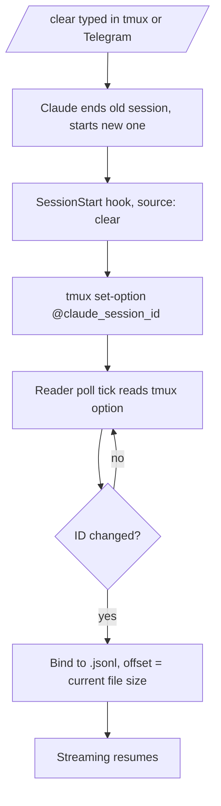

# Skills Browser Rework + `/clear` Auto-Hop — Design

- **Date:** 2026-09-12, 18:20 local
- **Status:** Approved in chat; ready for implementation planning
- **Repo:** `claude-code-telegram-coolify/claude-telegram-bridge`

## 1. Problem

Two gaps in the bridge:

1. **Skills browser.** The `/skills` menu lists 6 stale built-in commands (`clear`, `compact`, `cost`, `doctor`, `review`, `help`), hides where each skill comes from, and never shows plugin skills. Plugin availability differs per project, so a project-aware view is needed.
2. **`/clear` goes silent.** Bridge sessions run `claude --session-id <uuid>`, and the transcript reader pins to `<uuid>.jsonl`. A `/clear` (also `/resume`, `/branch`) starts a **new** Claude session ID and a **new** transcript file. The reader keeps watching the dead file; the bridge stops streaming. Only `/compact` keeps the same ID.

## 2. Goals

- **A.** Built-ins: keep `clear` + `compact`, drop `cost`/`doctor`/`review`/`help`, add `model` and `effort` pickers.
- **A.** Every menu entry shows its source: 📁 local, 🌐 global, 🧩 plugin.
- **A.** Plugin skills are discovered from `installed_plugins.json`, filtered to global installs and the active project's installs.
- **B.** After `/clear` (or `/resume`, `/branch`), the reader re-binds to the new transcript automatically. No re-connect.

**Non-goals:** no model switching logic inside the bridge (the Claude CLI stays the executor); no effort values beyond the 5 levels below; no skill enable/disable from Telegram; no hooks for sessions the bridge did not launch.

## 3. Part A — Skills Browser

### 3.1 Built-in commands (`src/skills/scanner.js`)

```js
getBuiltInCommands() // after change
[
  { id: 'builtin:clear',   name: 'clear',   command: '/clear',   description: 'Clear conversation context and restart clean' },
  { id: 'builtin:compact', name: 'compact', command: '/compact', description: 'Summarize and compress current chat history' },
  { id: 'builtin:model',   name: 'model',   command: '/model',   description: 'Switch model (fable, opus, sonnet, haiku)',
    choices: ['fable', 'opus', 'sonnet', 'haiku'] },
  { id: 'builtin:effort',  name: 'effort',  command: '/effort',  description: 'Adjust thinking effort',
    choices: ['low', 'medium', 'high', 'xhigh', 'max'] }
]
```

- Verified against Claude Code docs: `/model <alias>` and `/effort <level>` accept direct arguments. `ultracode` and `auto` effort values exist but are out of scope.
- A builtin with `choices` gets a picker inspect view (3.5) instead of run buttons.
- Bare Telegram passthrough already works: typing `/model opus` matches `commandMapping` and injects `"/model opus"` (`index.js:562`). No change needed.

### 3.2 Source tags for directory skills

`resolveSkillsDirectories()` now returns labeled pairs instead of plain paths:

| Dir | Label |
|-----|-------|
| `<cwd>/.claude/skills` (bridge repo) | `local` |
| `<home>/.claude/skills` | `global` |
| `<PROJECTS_DIR>/<project>/.claude/skills` (active session only) | `project` |

`scanSkills()` copies the label into each result as `source`. Dedup is unchanged: the first directory that owns a name wins (cwd → home → project order), and the winner's source is shown. This matches what `/name` actually runs in Claude Code.

Icons (`src/skills/menu.js` `getSkillIcon`):

| Source | Icon |
|--------|------|
| builtin | ⌨️ |
| `local` / `project` | 📁 |
| `global` | 🌐 |
| `plugin` | 🧩 |
| fallback | ⚡ |

### 3.3 Plugin skill discovery (new `scanPluginSkills()` in `scanner.js`)

```js
scanPluginSkills({ home, projectPath }) → results
```

- Read `<home>/.claude/plugins/installed_plugins.json` (version 2 shape: `plugins: { "<name>@<marketplace>": [entry] }`).
- Select entries:
  - entry without `projectPath` → **global** plugin install;
  - entry whose `projectPath` resolves equal to the active project path → **project** plugin install (case-insensitive compare).
- For each selected entry, scan `<installPath>/skills/*/SKILL.md`.
- Result shape: `{ id: 'plugin:<plugin>:<name>', name: '<plugin>:<name>', description, command: '/<name>', source: 'plugin' }`.
- Priority: a project-scoped entry beats a global entry of the same plugin. Dedup key: `installPath` + skill name.
- File missing or corrupt → `console.warn` + return `[]`.
- Known overlap: a plugin skill and a personal skill may share a bare name; both entries then appear with different ids. The command string is identical (`/<name>`); Claude resolves invocation. No cross-kind dedup.

### 3.4 Wiring (`src/index.js` `refreshSkills`)

```js
cachedSkills = [...builtins, ...scanned, ...pluginSkills];
```

- Project path for the plugin filter: `path.join(config.projectsDir, activeSessionName.replace(/^claude-/, ''))`.
- No active session → only global plugin installs are scanned.

### 3.5 Inspect view + choice callback (`src/skills/menu.js`, `src/index.js`)

`buildSkillInspectView(skill)`:

- If `skill.choices` exists → one button per choice (2 per row), `callback_data: 'skill_choice:<skill.id>:<choice>'`; no Run / Run-with-arguments buttons.
- Else → current run buttons, unchanged.
- Non-builtin entries gain a `Source:` line in the view body.

New handler in `index.js`:

```js
bot.action(/skill_choice:(builtin:\w+):(\w+)/, async (ctx) => { ... })
```

- Looks up the builtin by id (choices only exist on builtins, so the regex is safe).
- Requires an active session (same guard as `skill_run_now`).
- Injects `` `${skill.command} ${choice}` `` into tmux, then confirms with an `answerCbQuery` + a short reply.

### 3.6 Diagnostics (`src/diagnostics.js`)

`/diag` keeps per-directory skill counts and gains the source label per directory, plus a plugin section listing selected `installPath` values with skill counts.

## 4. Part B — `/clear` Auto-Hop

Verified facts (code.claude.com docs):

- `/clear`, `/resume`, `/branch` start a new session ID and a new `.jsonl`; `/compact` keeps the ID.
- A `SessionStart` hook fires with sources `startup | resume | clear | compact | fork`; stdin JSON carries `session_id`, `source`, `transcript_path`, `cwd`, `hook_event_name`.
- Hooks from a `--settings <file>` launch flag run **without** the interactive "check hooks" review prompt (operator-provided file is trusted).
- Hook processes inherit the parent environment, including `TMUX`; a bare `tmux set-option @opt v` inside a pane targets that pane's own session.

### 4.1 SessionStart hook (new `hooks/claude-session-id-sync.sh`)

```sh
#!/bin/sh
# Publish the live Claude session id onto the tmux session that runs this claude.
[ -n "$TMUX" ] || exit 0
input=$(cat)
sid=$(printf '%s' "$input" | node -e '
  let d="";process.stdin.on("data",c=>d+=c).on("end",()=>{
    try { console.log(JSON.parse(d).session_id || "") } catch {}
  })')
[ -n "$sid" ] && tmux set-option @claude_session_id "$sid"
exit 0
```

- Runs on **all** SessionStart sources. `compact` re-sets the same ID (harmless); `clear`/`resume`/`fork` set the new one; `startup` matches the value `startFreshSession` already sets.
- No-ops outside tmux (no `$TMUX`), so non-bridge environments are unaffected.
- Hook script timeout: 5 s.

### 4.2 Settings file + launch flag (`src/projects/manager.js`)

- `--settings` needs an absolute hook command path, so the bridge **generates** `hooks/claude-bridge-settings.generated.json` at startup (idempotent overwrite) with the absolute path of the hook script baked in.
- `startFreshSession()` appends `--settings <generated file>` to the `claude` launch command.
- Scope: only bridge-launched sessions carry the hook. No global settings change.



### 4.3 Reader re-bind (`src/tmux/session_reader.js`)

- `ClaudeSessionReader.start()` accepts `options.getBoundSessionId` (async callback).
- Every 5th poll tick: call `getBoundSessionId()`. Errors (option not set, tmux down) → treat as null, keep the current binding.
- New non-empty ID ≠ current ID → set `this.sessionId`, resolve the new file, set its offset to the **current file size** (adopt from "now", no replay of pre-hop lines), continue streaming.
- `index.js` `switchActiveSession()` passes `() => tmux.getSessionOption(sessionName, '@claude_session_id')` as the callback (closure over the current session name; the reader is recreated on every switch).

### 4.4 Consequences

- ⚠️ First events after a hop may arrive up to 5 s late. Acceptable for chat pace.
- `/compact` produces no hop (same ID).
- Bonus: any manually started `claude` inside a tmux pane also gets `@claude_session_id` published; the bridge can then bind to it on Connect.

## 5. Error Handling

| Case | Behavior |
|------|----------|
| `installed_plugins.json` missing/corrupt | warn + plugin skills skipped |
| Plugin `installPath` missing | skip that plugin silently |
| tmux option read fails | keep current reader binding |
| Hook fails / times out | Claude logs it; bridge falls back to 5 s re-check loop failing open — old binding kept |
| `skill_choice` with no active session | existing ⚠️ "no active session" reply |
| Skill dir unreadable | existing warn path (unchanged) |

## 6. Testing

| Test | Covers |
|------|--------|
| `test/skills_scanner.test.js` (update) | builtin list: `clear`, `compact`, `model`+choices, `effort`+choices; `cost`/`doctor`/`review`/`help` absent |
| `test/plugin_skills.test.js` (new) | fake home + cache tree: global + project selection, project-beats-global priority, dedup, corrupt JSON → `[]` |
| `test/skills_menu.test.js` (update) | icon per source; choice picker buttons + `callback_data`; `Source:` line; run buttons hidden for choices |
| `test/session_reader.test.js` (update) | re-bind on ID change with short poll interval; offset adopts file size; read failure keeps binding |
| `test/integration.test.js` (update) | launch command contains `--settings`; generated settings file exists and points at the hook script |

## 7. Files Touched

| File | Change |
|------|--------|
| `src/skills/scanner.js` | builtin list, labeled dirs, `scanPluginSkills()` |
| `src/skills/menu.js` | icons, choice picker inspect view, `Source:` line |
| `src/index.js` | merge plugin skills, pass project path, `skill_choice` handler, pass `getBoundSessionId` |
| `src/projects/manager.js` | generate settings file, append `--settings` to launch |
| `src/diagnostics.js` | source labels + plugin section |
| `src/tmux/session_reader.js` | periodic re-bind poll |
| `hooks/claude-session-id-sync.sh` (new) | SessionStart hook |
| test files | per §6 |

## 8. Out of Scope

- `ultracode` / `auto` effort values; a `default`/`opusplan` model slot.
- Skill enable/disable or plugin management from Telegram.
- Hooks for sessions the bridge did not launch.
- Changes to the Telegram command passthrough path (`commandMapping`).